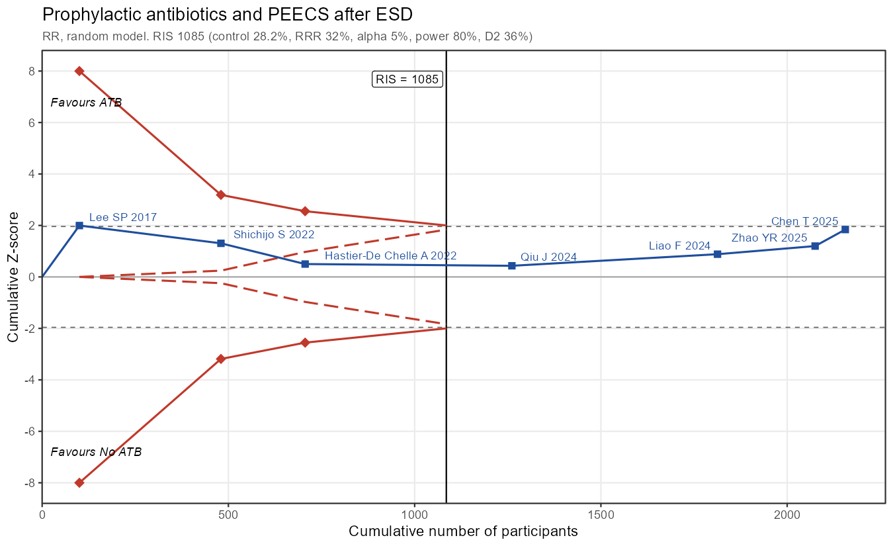

# easyTSA

**Trial Sequential Analysis for `meta` objects, in R.**

---

## 1. What is this package

`easyTSA` runs a Trial Sequential Analysis (TSA, Copenhagen Trial Unit)
on a meta-analysis you have already fitted with the
[`meta`](https://cran.r-project.org/package=meta) package, and draws
the familiar TSA graph with `ggplot2`. It does not replace the TSA
program: it makes the common path (a `metabin()` object in, a TSA
plot and a `.TSA` file out) a three-line job, and it can hand the same
analysis to the original Java program.

**What you get:**

- **`tsa_create()`** - required information size (RIS) with
  D-squared heterogeneity adjustment, cumulative Z-curve in trial
  order, Lan-DeMets O'Brien-Fleming monitoring boundaries, futility
  boundaries (inner wedge), TSA-adjusted confidence interval and a
  plain-language conclusion. Reads every setting (effect measure,
  model, continuity correction) from the `meta` object.
- **`tsa_plot()`** - the TSA graph as a `ggplot` you can restyle or
  extend with `+`.
- **`summary()`** - per-look table (N, information fraction, Z,
  boundaries) and conventional vs TSA-adjusted CI.
- **`tsa_write()` / `tsa_read()`** - `.TSA` files in the format of the
  TSA program (version 0.9.5.10 Beta), both directions.
- **`tsa_launch()`** - starts the TSA program on the file (needs Java
  and the program, see section 6).
- **Building blocks** - `tsa_ris()`, `tsa_diversity()`,
  `tsa_bounds()`, `tsa_futility()`, `tsa_spending()` for anyone who
  wants the numbers without the wrapper.

---

## 2. How to install it

```r
# install.packages("remotes")
remotes::install_github("vanioljantunes/easyTSA")
```

Dependencies: `meta`, `ggplot2`. Nothing else.

---

## 3. Worked example: prophylactic antibiotics and PEECS after ESD

The bundled dataset `atb_peecs` holds the seven comparative studies of
prophylactic antibiotics (ATB) versus none for post-ESD
electrocoagulation syndrome (PEECS).

```r
library(meta)
library(easyTSA)

m <- metabin(event.e, n.e, event.c, n.c, data = atb_peecs,
             studlab = paste(author, year), sm = "RR",
             method = "MH", method.tau = "REML",
             random = TRUE, common = FALSE)

x <- tsa_create(m, label.e = "ATB", label.c = "No ATB",
                title = "Prophylactic antibiotics and PEECS after ESD")
x
```

Defaults: 5% two-sided conventional boundary, alpha-spending boundary
on the sample-size axis with 80% power, anticipated effect taken from
the meta output (each arm's event proportion averaged with the model
weights), and the RIS inflated by the diversity D-squared of the model.

```
Trial Sequential Analysis: Prophylactic antibiotics and PEECS after ESD
  ATB vs No ATB, RR, random model, 7 trials, 2156 participants
  Anticipated effect (empirical, weighted arms): control 28.17%, intervention 19.16%, RRR 32.0%
  alpha 0.05 (two-sided), power 80%, OBF spending
  Diversity adjustment: D2 = 35.6% (factor 1.55)
  RIS = 1085 (fixed-effect RIS = 698); information fraction 198.7%
  Cumulative Z = 1.84; boundary at last look = 1.96
  Conclusion: Futility boundary crossed at look 3 (Hastier-De Chelle A 2022):
  the anticipated effect can be rejected.
```

```r
summary(x)
```

```
 Look                    Study Year    N    IF     Z Boundary Futility
    1              Lee SP 2017 2017  100 0.092 1.996    8.000
    2          Shichijo S 2022 2022  480 0.442 1.306    3.187    0.244
    3 Hastier-De Chelle A 2022 2022  706 0.651 0.500    2.554    0.971
    4               Qiu J 2024 2024 1261 1.162 0.432    1.960
    5              Liao F 2024 2024 1813 1.671 0.883    1.960
    6             Zhao YR 2025 2025 2075 1.912 1.199    1.960
    7              Chen T 2025 2025 2156 1.987 1.841    1.960

Final estimate (RR):
         type estimate lower upper z_boundary
 conventional    0.748  0.55 1.019       1.96
 TSA-adjusted    0.748  0.55 1.019       1.96
```

```r
tsa_plot(x, show_labels = TRUE)
```



Reading: the blue squares are the cumulative Z after each study, the red
diamonds the monitoring boundaries, the dashed wedge the futility
boundaries, the vertical line the RIS. The Z-curve entered the inner
wedge at the third study and the RIS has been passed twice over, so an
effect of the empirical size (RRR 32%) can be rejected; the final
estimate stays below conventional significance.

A clinically chosen effect instead of the empirical one:

```r
tsa_create(m, rrr = 0.30, control = 0.12)   # RIS 3338, IF 65%, inconclusive
```

---

## 4. The three decisions

| Argument | Meaning | Default |
|---|---|---|
| `rrr` (or `md`) | anticipated relative risk reduction (mean difference) | "empirical": `1 - p_e / p_c` from the weighted arm proportions of `m` |
| `control` | anticipated control-group risk | weight-averaged control-arm proportion of `m` |
| `intervention` | anticipated intervention-group risk (alternative to `rrr`) | weight-averaged intervention-arm proportion of `m` |
| `diversity` | heterogeneity adjustment of the RIS | `"D2"` from `m`; also `"I2"`, `"none"`, or a number |

Other settings: `alpha` (0.05), `beta` (0.20), `futility` (TRUE),
`model` ("random" or "common"), `outcome` ("negative" = event is a
harm, so RR < 1 favours the intervention), `sortvar` (trial order,
default the `year` column).

---

## 5. Customising the plot

```r
tsa_plot(x,
  title = "PEECS", subtitle = NULL,
  show_futility = FALSE, show_conventional = FALSE,
  show_labels = TRUE, show_favours = FALSE,
  ris_label = "RIS (D2-adjusted)",
  col_z = "black", col_bound = "firebrick",
  ylim = c(-6, 6)) +
  ggplot2::theme_classic()

ggplot2::ggsave("tsa.png", tsa_plot(x), width = 9, height = 5.5, dpi = 300)
```

See `?"easyTSA-3-plot"`.

---

## 6. The TSA program

The TSA program is free to use but its license does not allow
redistribution, so it is not bundled. Download it from
<https://ctu.dk/tsa/>, unzip, and point easyTSA to it:

```r
Sys.setenv(TSA_HOME = "C:/Users/me/TSA 0.9.5.10 Beta")   # folder with TSA.jar
tsa_write(x, "peecs.TSA")   # file only
tsa_launch(x)               # writes the file and starts the program
```

The file carries the trials, a conventional boundary and an
alpha-spending boundary with the same RRR, power and diversity used in
R (as user-defined values, so the RIS matches). In the program:
`File > Open`, then perform the calculations.

---

## 7. Documentation

```r
?easyTSA                 # overview
?"easyTSA-1-workflow"    # from meta object to plot
?"easyTSA-2-theory"      # RIS, boundaries, wedge, adjusted CI
?"easyTSA-3-plot"        # plot options
?"easyTSA-4-software"    # the TSA program
```

## 8. Method notes

- RIS follows the TSA manual equation 1: `4 (z_{1-a/2} + z_{1-b})^2
  sigma^2 / delta^2`, inflated by `1 / (1 - D^2)` with
  `D^2 = 1 - v_fixed / v_random` taken from the `meta` object.
- Boundaries are computed by the Lan-DeMets recursive integration with
  the O'Brien-Fleming-type spending function, spending `alpha / 2` per
  side (the convention of the Lan-DeMets program the TSA software uses;
  four equal looks at 5% give 4.33, 2.96, 2.36, 2.01). Boundaries are
  truncated at 8 and drawn out to the RIS.
- Futility boundaries spend `beta` under the drift of the anticipated
  effect and are shown once they emerge above zero.
- The Z-curve uses `meta`'s own estimates, so any `method.tau` works;
  use `method.tau = "DL"` to match the program's default model.

## 9. License

MIT. The TSA program and its manual are copyright Copenhagen Trial
Unit and are not part of this package.
